# Auth Service — Implementation Guide

## Contexto

Você é o agente responsável por implementar/refatorar o **Auth Service** desta plataforma.

Você terá acesso a:

1. Este documento (`AUTH_SERVICE_GUIDE.md`);
2. O contrato OpenAPI fornecido pelo projeto;
3. O código-fonte atual da API.

**Regra principal:** trate o contrato OpenAPI e o código existente como fontes de verdade que precisam ser analisadas antes de alterar qualquer coisa. Não assuma que a implementação atual está correta só porque existe código para determinado comportamento.

Seu objetivo não é apenas "fazer funcionar". O objetivo é entregar um **Auth Service profissional, seguro, consistente e preparado para ser consumido por múltiplos microsserviços**.

---

# 1. Objetivo arquitetural

O Auth Service será o serviço central de:

- autenticação;
- identidade;
- emissão e validação de tokens;
- verificação de e-mail;
- recuperação de senha;
- gerenciamento de sessão;
- informações básicas de identidade/autorização.

Os demais microsserviços, como `academy`, `adm`, `comms` etc., não devem duplicar lógica de autenticação.

Arquitetura esperada:

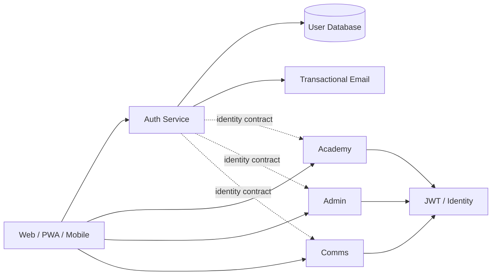

O Auth Service deve ser responsável por **quem é o usuário**.

Cada microsserviço deve ser responsável por **o que aquele usuário pode fazer dentro daquele domínio**.

---

# 2. Antes de alterar o código

Antes de implementar qualquer coisa:

1. Leia a estrutura completa do projeto.
2. Identifique:
   - entrypoint;
   - routes;
   - controllers;
   - services;
   - models;
   - middlewares;
   - configuração;
   - autenticação atual;
   - geração/validação JWT;
   - envio de e-mail;
   - tratamento de erros;
   - testes;
   - variáveis de ambiente.
3. Compare a implementação existente com o contrato OpenAPI.
4. Identifique divergências.
5. Preserve funcionalidades existentes que sejam válidas.
6. Não reescreva arquivos ou módulos sem necessidade.
7. Evite introduzir dependências apenas por preferência pessoal.
8. Antes de criar uma abstração nova, verifique se já existe uma equivalente no projeto.

**Não faça uma implementação paralela sem entender a existente.**

Se o código atual estiver parcialmente implementado, evolua-o de forma incremental.

---

# 3. Contrato atual

O contrato já define estes endpoints:

```text
POST /auth/register
GET  /auth/verify-email
POST /auth/resend-verification
POST /auth/login
GET  /auth/validate
GET  /auth/me
```

Eles devem continuar compatíveis com o contrato existente, salvo quando houver uma razão técnica ou de segurança forte para evolução.

Se precisar alterar o contrato, altere também a documentação OpenAPI e deixe a mudança explícita.

---

# 4. Responsabilidades dos endpoints

## POST /auth/register

Responsável por:

1. Validar entrada.
2. Normalizar e-mail.
3. Verificar se o usuário já existe.
4. Hash da senha com bcrypt ou mecanismo equivalente já adotado pelo projeto.
5. Criar usuário.
6. Criar token seguro de confirmação.
7. Persistir apenas o necessário para validar o token.
8. Enviar e-mail transacional.
9. Retornar o contrato esperado.

### Regra crítica de segurança

**Nunca permita que um usuário público escolha livremente `admin` no cadastro.**

O contrato atual possui:

```json
{
  "role": "aluno"
}
```

mas isso não significa que um cliente público possa promover a própria conta.

A implementação deve garantir:

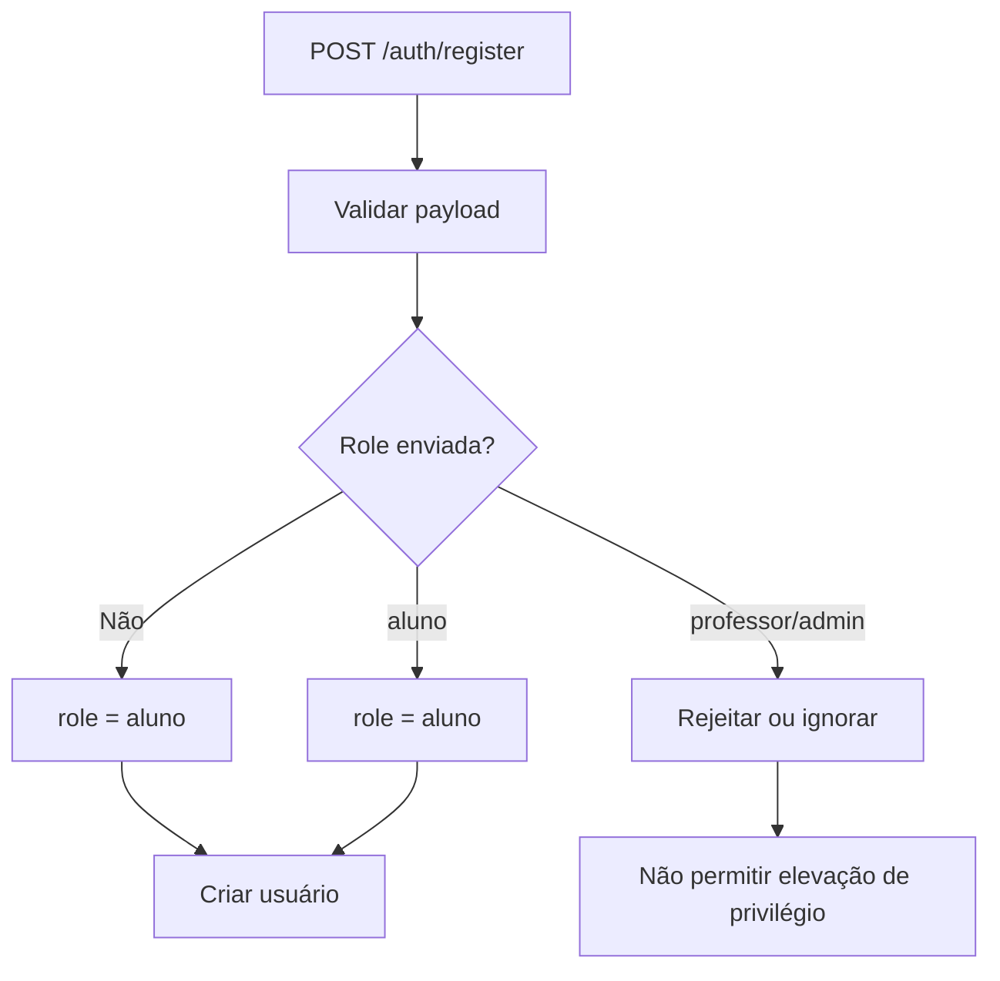

Se o sistema precisar criar `professor` ou `admin`, isso deve ocorrer por fluxo administrativo protegido.

---

# 5. Normalização de identidade

E-mail deve ser tratado de maneira consistente.

Exemplo:

```text
" Joao@Example.COM "
        ↓
"joao@example.com"
```

Defina uma única regra e utilize-a em:

- register;
- login;
- resend verification;
- forgot password;
- consultas internas.

Evite situações em que o cadastro normaliza o e-mail, mas o login não.

---

# 6. Senhas

Nunca armazene senha em texto puro.

Fluxo:

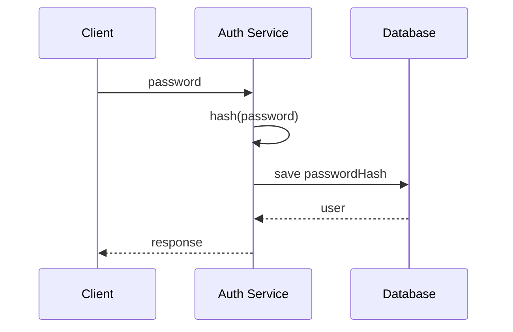

A senha original não deve:

- ser persistida;
- aparecer em logs;
- aparecer em respostas;
- ser incluída em JWT;
- ser enviada para outros microsserviços.

Use o mecanismo já existente no projeto quando ele for adequado.

---

# 7. Login

`POST /auth/login` deve:

1. Validar e-mail e senha.
2. Normalizar e-mail.
3. Buscar usuário.
4. Comparar senha com hash.
5. Verificar estado necessário da conta.
6. Emitir access token.
7. Emitir refresh token, caso o fluxo seja implementado.
8. Retornar o usuário sanitizado.

Não retorne:

- password hash;
- tokens internos de verificação;
- reset tokens;
- dados sensíveis desnecessários.

---

# 8. JWT

O JWT precisa ter um contrato explícito.

Preferencialmente utilize JWT assinado assimetricamente em produção, por exemplo:

```text
RS256
ou
ES256
```

A decisão deve respeitar a infraestrutura e as bibliotecas já existentes no projeto.

Payload conceitual:

```json
{
  "sub": "USER_ID",
  "role": "aluno",
  "emailVerified": true,
  "iss": "auth-service",
  "aud": "platform",
  "iat": 1755600000,
  "exp": 1755686400
}
```

## Claims

### `sub`

Identificador único do usuário.

### `role`

Role global da identidade.

Valores atuais:

```text
aluno
professor
admin
```

### `emailVerified`

Indica se o e-mail foi confirmado.

### `iss`

Issuer do token.

Exemplo:

```text
auth-service
```

### `aud`

Audience da plataforma.

Exemplo:

```text
platform
```

### `iat`

Timestamp de emissão.

### `exp`

Timestamp de expiração.

---

# 9. Access Token

O access token deve possuir vida relativamente curta.

Não fixe arbitrariamente uma duração sem verificar:

- comportamento atual da aplicação;
- requisitos do frontend;
- PWA/mobile;
- segurança;
- fluxo de refresh.

O valor deve ser configurável por variável de ambiente.

Exemplo conceitual:

```text
JWT_ACCESS_TOKEN_TTL
JWT_ISSUER
JWT_AUDIENCE
```

Não coloque segredo diretamente no código.

---

# 10. Refresh Token

A arquitetura deve estar preparada para refresh token.

Fluxo:

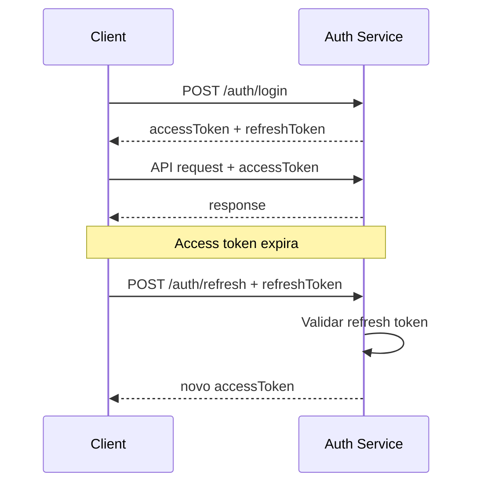

Adicionar:

```text
POST /auth/refresh
POST /auth/logout
```

se o projeto ainda não possuir esses endpoints.

O contrato OpenAPI também deve ser atualizado.

---

# 11. Refresh Token — segurança

Não trate refresh token como simplesmente outro JWT de longa duração sem avaliar o modelo de segurança.

Preferencialmente:

- token aleatório criptograficamente seguro;
- armazenamento seguro no backend;
- hash do token persistido quando aplicável;
- rotação de refresh tokens;
- revogação;
- expiração;
- detecção de reutilização quando o nível de segurança justificar.

Se a arquitetura existente já utiliza JWT refresh tokens, avalie a implementação atual antes de substituir.

---

# 12. Logout

Logout não deve ser apenas uma operação visual no frontend.

Se houver refresh token persistido/revogável:

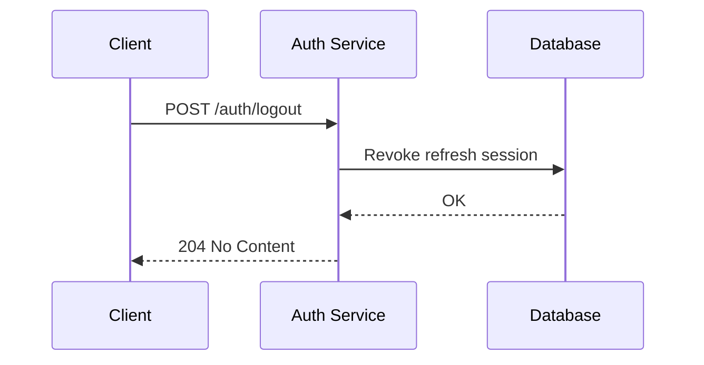

O access token de curta duração pode continuar tecnicamente válido até expirar, enquanto o refresh token é invalidado.

---

# 13. E-mail verification

O fluxo atual possui:

```text
POST /auth/register
        ↓
generate verification token
        ↓
send email
        ↓
GET /auth/verify-email?token=...
        ↓
emailVerified = true
```

Token de verificação deve:

- ser criptograficamente seguro;
- ter expiração;
- ser de uso único;
- não ser armazenado em texto puro se o modelo permitir armazenamento por hash;
- não aparecer em logs;
- ser invalidado após uso.

O contrato indica expiração de 24 horas. Preserve esse comportamento.

---

# 14. Resend verification

`POST /auth/resend-verification`

O contrato já estabelece uma resposta genérica para evitar enumeração de usuários.

Mantenha esse princípio.

Exemplo:

```text
Se o e-mail estiver cadastrado e não verificado,
um novo link foi enviado.
```

Mesmo que o e-mail:

- não exista;
- já esteja verificado;
- esteja em outra condição;

a resposta pública não deve revelar informações desnecessárias.

Também avalie rate limiting.

---

# 15. Evitar user enumeration

Principalmente em:

```text
POST /auth/login
POST /auth/resend-verification
POST /auth/forgot-password
```

Evite respostas que permitam descobrir quais e-mails existem.

Por exemplo, não crie diferenças observáveis como:

```text
"Usuário não encontrado"
```

versus:

```text
"Senha incorreta"
```

quando isso permitir enumeração.

O comportamento deve ser consistente.

---

# 16. /auth/validate

Este endpoint é importante porque existe como contrato para outros microsserviços.

Contrato conceitual:

```http
GET /auth/validate
Authorization: Bearer <JWT>
```

Resposta:

```json
{
  "valid": true,
  "user": {
    "id": "USER_ID",
    "role": "professor",
    "emailVerified": true
  }
}
```

Ele deve validar:

1. existência do Authorization header;
2. formato Bearer;
3. assinatura;
4. algoritmo esperado;
5. issuer;
6. audience;
7. expiração;
8. claims necessárias;
9. estrutura do payload.

Nunca aceite simplesmente:

```text
decode(token)
```

como prova de autenticidade.

**Decode não é verification.**

---

# 17. JWT local vs /auth/validate remoto

A arquitetura deve considerar dois modelos.

## Modelo recomendado

Os microsserviços validam o JWT localmente:

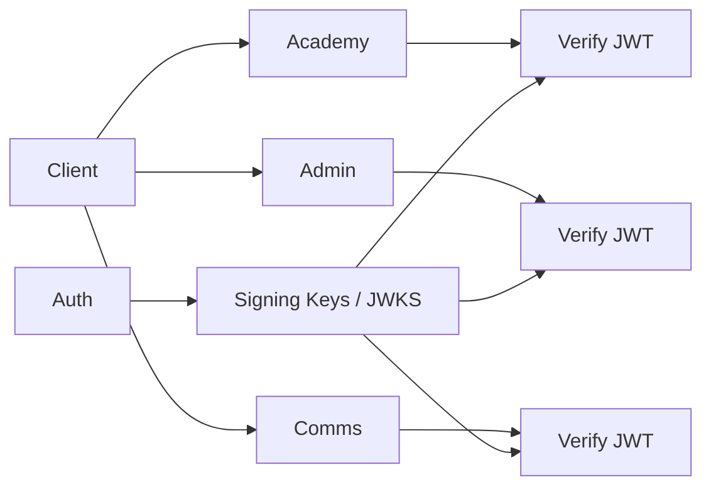

Isso evita:

```text
Academy -> Auth -> Database
```

em cada request.

Idealmente, use assinatura assimétrica e disponibilize chave pública por mecanismo apropriado, como JWKS, se isso fizer sentido para a arquitetura.

## /auth/validate

Mantenha o endpoint porque ele é parte do contrato e pode ser útil para:

- introspecção;
- integrações legadas;
- validações centralizadas;
- serviços que não conseguem validar JWT localmente.

Não transforme automaticamente cada request dos microsserviços em uma chamada síncrona ao Auth Service sem necessidade.

---

# 18. /auth/me

`GET /auth/me` deve buscar os dados atuais no banco.

Diferença conceitual:

```text
/auth/validate
    ↓
Valida identidade do token

/auth/me
    ↓
Busca estado atual do usuário
```

Isso é importante porque o banco pode ter sido alterado depois que o JWT foi emitido.

Exemplo:

```text
JWT:
role = professor

Banco:
role = aluno
```

`/auth/me` deve refletir o estado atual do banco.

Não confie apenas no payload do JWT para dados que precisam estar atualizados.

---

# 19. Separação entre Authentication e Authorization

Não misture responsabilidades.

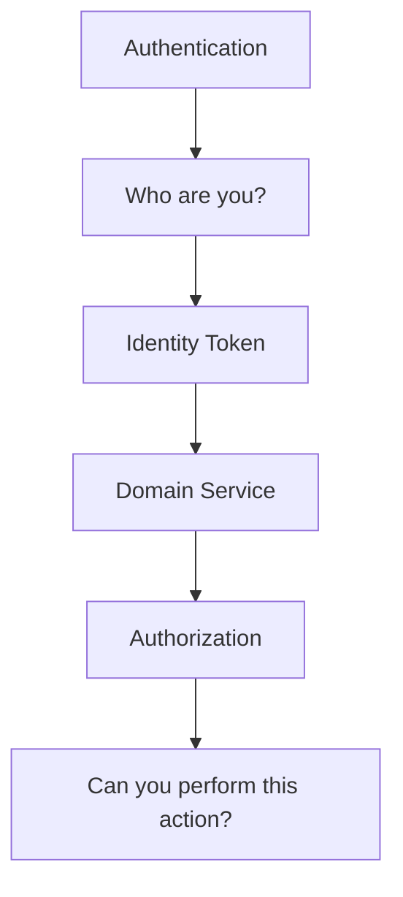

O Auth Service responde:

> Quem é você?

O domínio responde:

> Você pode fazer isso?

Exemplo:

```text
role = professor
```

não significa automaticamente:

```text
can_delete_any_course = true
```

Essa decisão pertence ao domínio e às regras de autorização.

---

# 20. RBAC

As roles atuais são:

```text
aluno
professor
admin
```

Mantenha uma definição centralizada.

Evite espalhar strings mágicas pelo código:

```javascript
if (user.role === "admin")
```

em dezenas de arquivos.

Prefira constantes/enums/abstrações já compatíveis com o projeto.

Exemplo conceitual:

```text
ROLE_STUDENT
ROLE_TEACHER
ROLE_ADMIN
```

ou equivalente em TypeScript.

---

# 21. Administração de roles

Não exponha no cadastro público:

```text
POST /auth/register
role=admin
```

Criação ou promoção deve exigir autorização.

Exemplo futuro:

```text
PATCH /users/:id/role
Authorization: Bearer <admin-token>
```

Esse endpoint pode pertencer ao Auth Service ou a um serviço administrativo, dependendo da arquitetura final.

---

# 22. Password recovery

O serviço deve estar preparado para:

```text
POST /auth/forgot-password
POST /auth/reset-password
```

Fluxo:

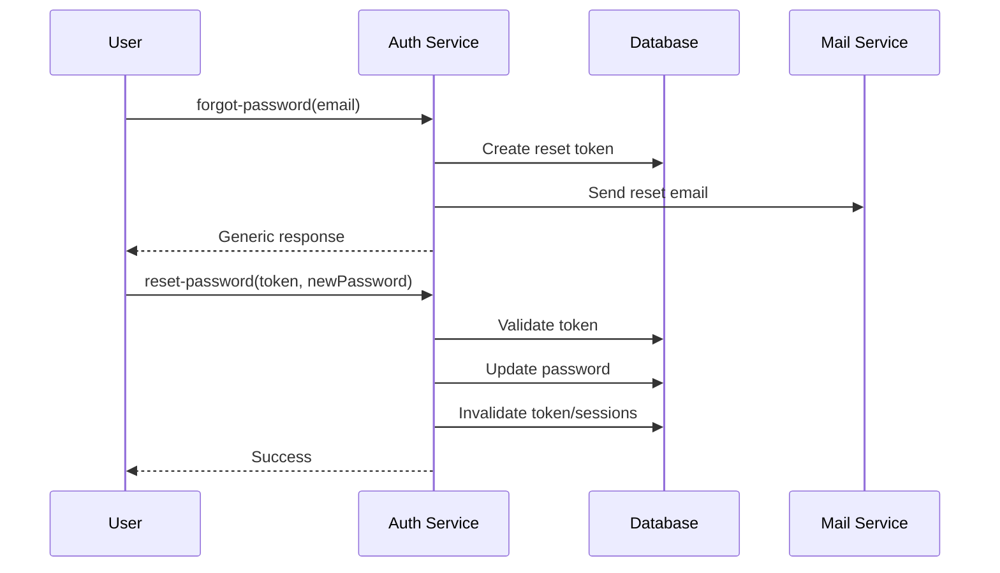

Não revele se o e-mail existe.

Depois de alterar a senha, considere invalidar sessões/refresh tokens existentes.

---

# 23. Tratamento de erros

Padronize respostas de erro.

Não deixe cada controller retornar um formato diferente.

Modelo recomendado:

```json
{
  "error": {
    "code": "INVALID_CREDENTIALS",
    "message": "Credenciais inválidas."
  }
}
```

Para validação:

```json
{
  "error": {
    "code": "VALIDATION_ERROR",
    "message": "Dados inválidos.",
    "details": [
      {
        "field": "email",
        "message": "E-mail inválido."
      }
    ]
  }
}
```

Não exponha:

- stack traces;
- queries;
- nomes de coleções/tabelas;
- detalhes internos;
- segredos;
- hashes.

Em desenvolvimento, logs podem ser mais detalhados, mas nunca devem registrar credenciais ou tokens sensíveis.

---

# 24. HTTP status codes

Use status codes semanticamente.

Exemplos:

```text
201 Created
400 Bad Request
401 Unauthorized
403 Forbidden
404 Not Found
409 Conflict
422 Unprocessable Entity (se adotado pelo projeto)
429 Too Many Requests
500 Internal Server Error
```

Distinção importante:

```text
401 = identidade/autenticação inválida ou ausente

403 = identidade conhecida, mas sem permissão
```

---

# 25. Rate limiting

Avalie rate limiting especialmente para:

```text
/auth/login
/auth/register
/auth/resend-verification
/auth/forgot-password
/auth/reset-password
```

Não permita que o endpoint de login vire um vetor simples de brute force.

Se o projeto já possuir infraestrutura de rate limiting, reutilize-a.

Se não possuir, implemente de forma coerente com o ambiente de produção.

---

# 26. Segurança HTTP

Verifique a existência de:

- CORS configurado corretamente;
- Helmet ou equivalente;
- rate limiting;
- body size limits;
- validação de payload;
- HTTPS em produção;
- cookies seguros quando cookies forem utilizados;
- `HttpOnly`;
- `Secure`;
- `SameSite`.

Não use:

```text
Access-Control-Allow-Origin: *
```

sem entender as implicações para autenticação e credenciais.

---

# 27. Secrets e configuração

Segredos devem estar fora do código.

Exemplos:

```text
JWT_PRIVATE_KEY
JWT_PUBLIC_KEY
JWT_ISSUER
JWT_AUDIENCE
JWT_ACCESS_TOKEN_TTL

DATABASE_URL

SMTP_HOST
SMTP_PORT
SMTP_USER
SMTP_PASSWORD
```

Os nomes devem respeitar o padrão já existente no projeto.

Não crie múltiplos sistemas de configuração.

---

# 28. Dados sensíveis no banco

Avalie o model/schema atual.

Dados como:

```text
passwordHash
emailVerificationToken
passwordResetToken
refreshToken
```

devem receber tratamento adequado.

Sempre que possível, prefira armazenar hashes de tokens de uso único em vez do token puro.

---

# 29. Auditoria

O Auth Service é um ponto sensível.

Avalie logs/auditoria para eventos como:

```text
LOGIN_SUCCESS
LOGIN_FAILURE
REGISTER
EMAIL_VERIFIED
PASSWORD_RESET
REFRESH
LOGOUT
ROLE_CHANGED
```

Nunca registre:

```text
password
JWT
refresh token
verification token
reset token
```

Se houver correlation/request ID no projeto, preserve-o.

---

# 30. Observabilidade

O serviço deve permitir identificar problemas sem expor dados sensíveis.

Logs devem responder:

```text
Quando?
Qual request?
Qual endpoint?
Qual status?
Quanto tempo levou?
Qual correlation ID?
Qual foi a categoria do erro?
```

Métricas úteis:

```text
auth_login_success_total
auth_login_failure_total
auth_register_total
auth_email_verification_total
auth_password_reset_total
auth_request_duration
auth_http_errors_total
```

Não é necessário criar uma plataforma de observabilidade nova se o projeto já possui uma.

Integre ao padrão existente.

---

# 31. Testes

Não considere a implementação pronta apenas porque a API responde 200.

Cubra pelo menos:

## Register

- cadastro válido;
- e-mail inválido;
- senha inválida;
- e-mail duplicado;
- role inválida;
- tentativa de criar admin publicamente;
- hash de senha;
- envio de verification email.

## Login

- credenciais válidas;
- senha errada;
- e-mail inexistente;
- e-mail não verificado, caso essa seja regra do produto;
- JWT válido;
- JWT com claims esperadas.

## Verification

- token válido;
- token expirado;
- token inexistente;
- token já utilizado;
- token inválido.

## Validate

- sem Authorization;
- Bearer inválido;
- JWT expirado;
- assinatura inválida;
- issuer inválido;
- audience inválida;
- claims inválidas;
- JWT válido.

## Me

- usuário válido;
- usuário inexistente;
- token inválido.

## Segurança

- enumeração;
- brute force/rate limit, se implementado;
- privilege escalation;
- exposição de dados sensíveis.

---

# 32. Testes de contrato

Como outros microsserviços dependerão deste serviço, testes de contrato são especialmente importantes.

A implementação deve continuar compatível com:

```text
OpenAPI contract
        ↓
Auth Service
        ↓
Academy / Admin / Comms / ...
```

Se mudar:

- response;
- status code;
- nome de campo;
- enum;
- header;
- formato de erro;

avalie impacto nos consumidores.

---

# 33. Documentação OpenAPI

O OpenAPI não deve ser tratado como documentação decorativa.

Ele é o **contrato entre serviços**.

Sempre que implementar ou alterar um endpoint:

1. atualize o OpenAPI;
2. atualize schemas;
3. atualize responses;
4. documente security;
5. documente erros;
6. mantenha exemplos coerentes.

Se adicionar:

```text
POST /auth/refresh
POST /auth/logout
POST /auth/forgot-password
POST /auth/reset-password
```

adicione-os ao contrato.

---

# 34. Health checks

Verifique se o serviço já possui health checks.

Idealmente:

```text
GET /health
GET /ready
```

Conceito:

```mermaid
flowchart LR
    LB[Load Balancer] --> Health[/health]
    LB --> Ready[/ready]

    Ready --> DB[(Database)]
```

`health` deve ser simples.

`ready` pode verificar dependências essenciais conforme a arquitetura.

Não coloque autenticação nesses endpoints.

---

# 35. Graceful shutdown

Como é um serviço backend, verifique:

- fechamento de conexões do banco;
- encerramento do servidor HTTP;
- workers;
- filas;
- SMTP clients;
- timers;
- conexões externas.

A aplicação deve responder adequadamente a:

```text
SIGTERM
SIGINT
```

Isso será importante em Docker/Kubernetes.

---

# 36. Docker / produção

Não altere a estratégia de containerização sem analisar o projeto atual.

Verifique:

```text
Dockerfile
docker-compose
healthcheck
environment
port
non-root user
signal handling
```

O serviço deve ser adequado para execução atrás de:

```text
Nginx
Load Balancer
API Gateway
Kubernetes
ECS
```

conforme o ambiente da plataforma.

---

# 37. Frontend e CORS

O Auth Service pode ser consumido por:

```text
Web
PWA
Mobile
outros serviços
```

Não acople o Auth Service ao frontend.

O frontend deve apenas consumir o contrato.

Exemplo:

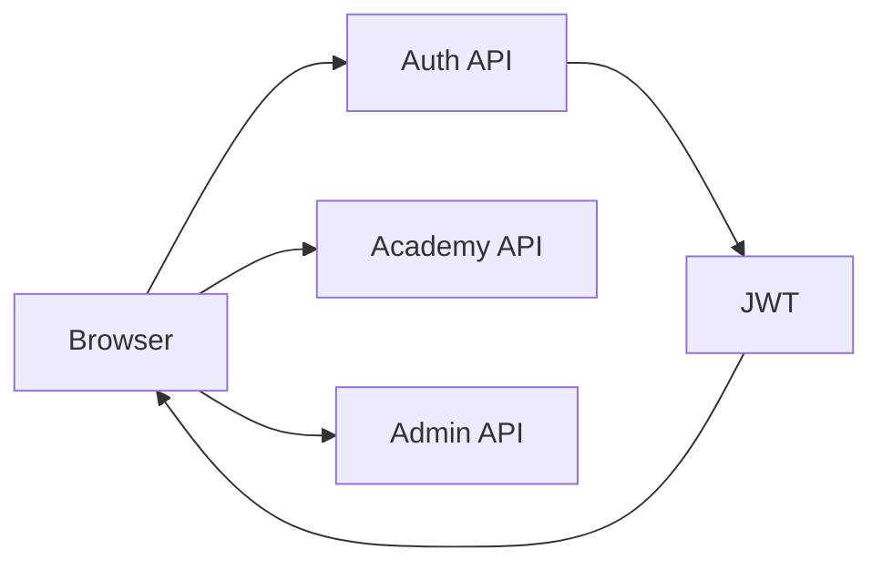

---

# 38. Não duplicar usuário nos microsserviços

Evite que:

```text
academy.users
admin.users
comms.users
```

tenham cópias completas da identidade.

O Auth Service é a fonte de verdade da identidade.

Outros serviços podem armazenar referências:

```text
userId
```

e dados específicos do domínio.

Exemplo:

```text
Auth Service
    User
      └── id
      └── name
      └── email
      └── role

Academy
    StudentProfile
      └── userId
      └── courseProgress
      └── achievements
```

---

# 39. Arquitetura alvo

A arquitetura conceitual esperada:

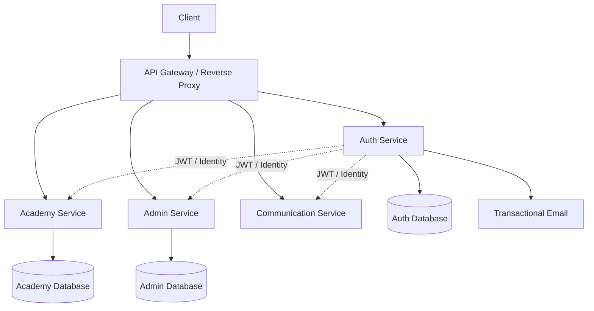

---

# 40. Fluxo completo de autenticação

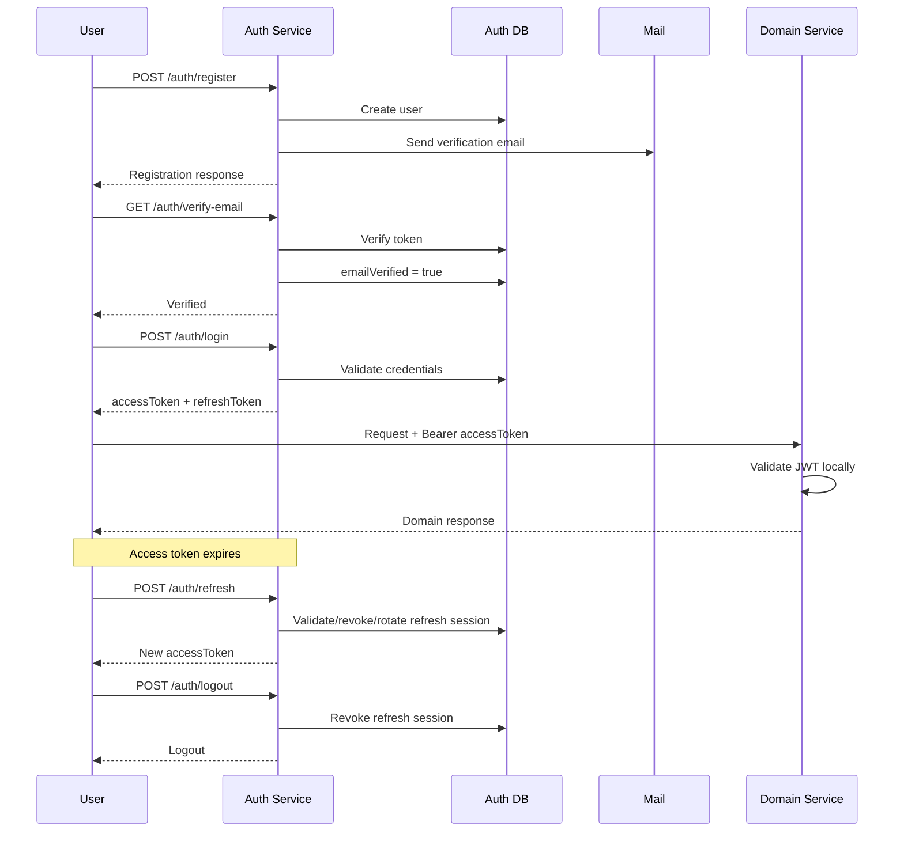

---

# 41. Princípios de implementação

Durante a implementação, siga estas regras:

### Não faça

- Não reescreva o projeto inteiro.
- Não crie arquitetura paralela.
- Não duplique lógica existente.
- Não introduza bibliotecas sem necessidade.
- Não exponha secrets.
- Não aceite `admin` no cadastro público.
- Não confie em `jwt.decode()` para autenticação.
- Não coloque senha/token em logs.
- Não quebre o contrato sem necessidade.
- Não implemente apenas o "happy path".

### Faça

- Leia o código antes.
- Compare código e contrato.
- Preserve compatibilidade.
- Centralize regras de autenticação.
- Valide entradas.
- Sanitize responses.
- Padronize erros.
- Escreva testes.
- Atualize OpenAPI.
- Considere segurança desde o primeiro commit.
- Faça mudanças pequenas e verificáveis.

---

# 42. Estratégia de implementação

Execute o trabalho nesta ordem:

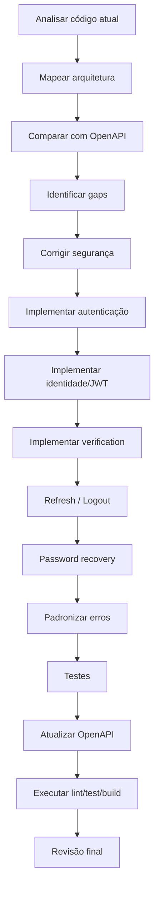

Não precisa implementar todos os itens futuros se o código/produto ainda não exigir isso. Porém, **não crie dívida estrutural** para funcionalidades previsíveis.

---

# 43. Critério de "pronto"

Considere a implementação pronta somente quando:

- [ ] O contrato OpenAPI está respeitado.
- [ ] O código atual foi analisado antes das mudanças.
- [ ] Não existe privilege escalation pelo register.
- [ ] Senhas são armazenadas apenas como hash.
- [ ] JWT é realmente validado.
- [ ] JWT possui claims e validações bem definidas.
- [ ] Segredos estão fora do código.
- [ ] Tokens de verificação são seguros.
- [ ] Verification possui expiração e uso único.
- [ ] Resend não permite enumeração simples.
- [ ] Erros possuem formato consistente.
- [ ] Responses não vazam dados sensíveis.
- [ ] `/auth/me` consulta estado atual.
- [ ] `/auth/validate` possui comportamento consistente para consumidores.
- [ ] Roles estão centralizadas.
- [ ] Admin não pode ser criado via cadastro público.
- [ ] Rate limiting foi avaliado para endpoints sensíveis.
- [ ] Testes cobrem happy path e failure paths.
- [ ] Testes de segurança relevantes existem.
- [ ] OpenAPI está atualizado.
- [ ] Lint passa.
- [ ] Testes passam.
- [ ] Build passa.
- [ ] Não existem TODOs críticos introduzidos pela implementação.

---

# 44. Entrega esperada do agente

Ao finalizar, não responda apenas:

> "Implementado."

Faça um resumo objetivo contendo:

## Alterações realizadas

Liste os principais arquivos/módulos alterados e o motivo.

## Segurança

Explique brevemente:

- JWT;
- password hashing;
- verification tokens;
- roles;
- rate limiting;
- secrets;
- refresh tokens, se implementados.

## Contrato

Informe:

- endpoints mantidos;
- endpoints adicionados;
- alterações no OpenAPI;
- possíveis breaking changes.

## Testes

Informe exatamente o resultado de:

```text
lint
test
build
```

## Pendências

Liste somente pendências reais.

Não esconda problemas.

Se encontrar uma limitação arquitetural no código atual, explique-a em vez de mascará-la.

---

# 45. Regra final

Você está implementando um **serviço de identidade que será dependência de outros serviços**.

Portanto, priorize nesta ordem:

```text
1. Segurança
2. Contrato
3. Compatibilidade
4. Correção
5. Observabilidade
6. Testabilidade
7. Manutenibilidade
8. Performance
```

Não faça overengineering.

A implementação deve ser **simples onde pode ser simples e rigorosa onde segurança e contrato exigem rigor**.

Antes de escrever código, entenda o que já existe.

Depois de escrever código, prove que funciona.
