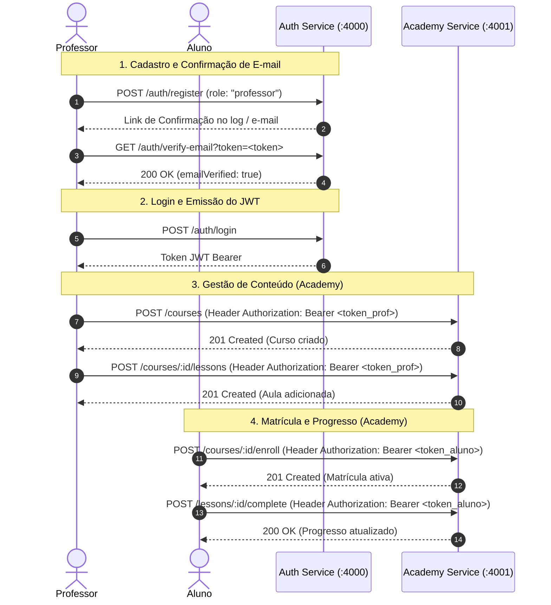

# Guia de Testes e Validação End-to-End (E2E)

Este documento descreve o fluxo completo de interoperabilidade entre o **Auth Service (`:4000`)** e o **Academy Service (`:4001`)**, com comandos `curl` prontos para cópia e execução.

---

## 1. Visão Geral da Arquitetura



---

## 2. Passo a Passo de Execução Prática

### Passo 1: Verificar se os dois serviços estão no ar
```bash
# Health check do Auth
curl -s http://localhost:4000/health

# Health check do Academy
curl -s http://localhost:4001/health
```

---

### Passo 2: Cadastrar Professor no Auth Service (:4000)
```bash
curl -s -X POST http://localhost:4000/auth/register \
  -H "Content-Type: application/json" \
  -d '{
    "name": "Prof. Carlos Silva",
    "email": "prof.carlos@test.com",
    "password": "senhaProfessor123@",
    "role": "professor"
  }'
```

---

### Passo 3: Confirmar E-mail do Professor
No terminal do `auth` (ou logs do Docker `docker compose logs -f auth`), copie o token gerado e execute:

```bash
# Substitua TOKEN_DO_LOG pelo token gerado
curl -s "http://localhost:4000/auth/verify-email?token=TOKEN_DO_LOG"
```
*Retorno esperado: `{"success":true,"message":"E-mail verificado com sucesso!"}`*

---

### Passo 4: Fazer Login do Professor e Guardar o Token JWT
```bash
curl -s -X POST http://localhost:4000/auth/login \
  -H "Content-Type: application/json" \
  -d '{
    "email": "prof.carlos@test.com",
    "password": "senhaProfessor123@"
  }'
```
*Copie o campo `"token"` retornado.*

---

### Passo 5: Criar Curso no Academy Service (:4001)
```bash
# Substitua TOKEN_PROFESSOR pelo token copiado no passo 4
curl -s -X POST http://localhost:4001/courses \
  -H "Content-Type: application/json" \
  -H "Authorization: Bearer TOKEN_PROFESSOR" \
  -d '{
    "title": "Arquitetura de Microsserviços com Node.js e Docker",
    "description": "Curso completo e prático cobrindo autenticação JWT, RBAC, CI/CD e testes em containers.",
    "category": "Backend",
    "price": 0,
    "status": "published",
    "visibility": "public"
  }'
```
*Copie o campo `"_id"` do curso retornado.*

---

### Passo 6: Adicionar Aula ao Curso no Academy (:4001)
```bash
# Substitua ID_DO_CURSO e TOKEN_PROFESSOR
curl -s -X POST http://localhost:4001/courses/ID_DO_CURSO/lessons \
  -H "Content-Type: application/json" \
  -H "Authorization: Bearer TOKEN_PROFESSOR" \
  -d '{
    "title": "01 - Introdução aos Microsserviços e JWT",
    "content": "https://cdn.meusistema.com/videos/aula01.mp4",
    "durationMinutes": 20
  }'
```

---

### Passo 7: Consultar Curso e Grade de Aulas (Público)
```bash
curl -s http://localhost:4001/courses/ID_DO_CURSO
```

---

## 3. Por que isso funciona sem o Academy chamar o Auth?

Ambos os serviços compartilham a mesma chave secreta:
```env
JWT_SECRET="mesma_chave_secreta_em_ambos"
```

1. O `auth` assina o token com a chave.
2. O `academy` valida a assinatura matematicamente em **`0ms`** usando seu próprio middleware [`src/middlewares/auth.js`](src/middlewares/auth.js).
3. Se o token for válido e o papel for `professor` com `emailVerified: true`, o acesso é liberado instantaneamente.
