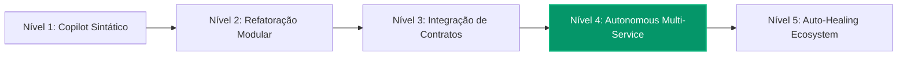

# 🤖 AI-Native Maturity & Engineering Velocity Index

Este diretório centraliza a telemetria, métricas de produtividade, esforço economizado e o **Índice de Maturidade AI-Native** do ecossistema Lumen.

---

## 📊 1. Resumo Executivo das Métricas

| Métrica Global | Valor Atual |
|---|:---:|
| **Nível de Maturidade AI-Native** | **Nível 4 (Autonomous Multi-Service Workflow)** |
| **Tempo Humano Equivalente Acumulado** | **~54 horas (~7 dias úteis)** |
| **Tempo Real com Antigravity / IA** | **~38 minutos** |
| **Multiplicador de Velocidade Médio (Velocity Multiplier)** | **~85x** |
| **Taxa de Sucesso na Esteira Integrada (`check:all`)** | **100% (4/4 microsserviços verdes)** |
| **Cobertura de Testes Automatizados** | **148+ testes unitários e de integração** |

---

## 🎯 2. Escala de Maturidade AI-Native (Framework Lumen)

1. **Nível 1 (Sintático):** Geração pontual de funções e snippets isolados.
2. **Nível 2 (Modular):** Refatoração de componentes completos com testes unitários locais.
3. **Nível 3 (Contratos & Interop):** Alinhamento de OpenAPI e consistência entre serviços.
4. **Nível 4 (Autonomous Multi-Service - ATUAL):** Orquestração paralela e evolução de arquitetura distribuída (Auth + Edge + Academy + Portal) com resolução de ponta a ponta sem quebras.
5. **Nível 5 (Auto-Healing):** Detecção proativa de anomalias em produção com geração autônoma de PRs corretivos e deploy com rollback automático.

---

## 📑 3. Documentos do Diretório

- [`VELOCITY_TRACKING.md`](./VELOCITY_TRACKING.md): Registro cronológico detalhado de cada tarefa, tempo real vs tempo humano, complexidade e arquitetura afetada.
