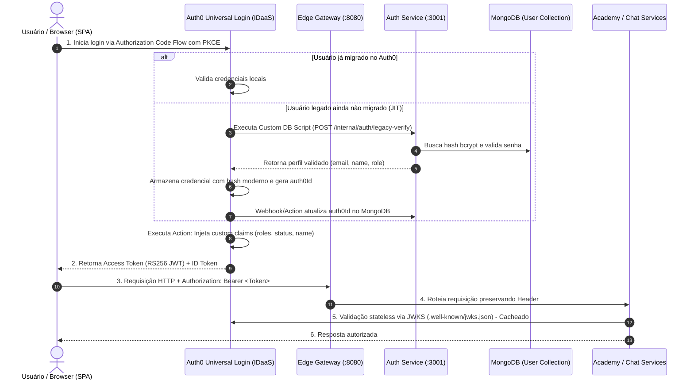

# 🛡️ Plano de Migração Arquitetural — Auth Service para Auth0 (IDaaS)

> **Documento Estratégico e Checklist de Engenharia**  
> **Status:** Proposta de Arquitetura & Plano de Ação  
> **Repositórios Envolvidos:** `auth`, `edge`, `academy`, `chat`, `v1-portal`, `pipelines`  
> **Abordagem de Migração:** Just-in-Time (JIT / Lazy Migration) sem forçar reset de senhas em massa.

---

## 📌 1. Visão Geral e Objetivos

Substituição da camada proprietária de gestão de credenciais e emissão de JWT simétrico (`HS256`) pelo **Auth0 (Identity as a Service - IDaaS)**.

### Objetivos Principais
1. **Elevação de Segurança**: Transferir custódia de senhas, hashing (`bcrypt`), mitigação de brute-force e fluxos de MFA para o Auth0.
2. **Tokens Assimétricos (RS256)**: Assinatura pública com chave assimétrica (JWKS) eliminando compartilhamento de segredo estático (`JWT_SECRET`) entre microsserviços.
3. **Zero Downtime**: Migração suave dos usuários ativos sem invalidação forçada de senhas usando **Auth0 Custom Database / Lazy Migration**.
4. **Desacoplamento de Papéis**: `auth-service` passa de "Provedor Monolítico de Identidade" a **Resource Server & Adaptador de Domínio**.

---

## 🏛️ 2. Arquitetura Alvo



---

## 🗺️ 3. Mapeamento de Claims e Contratos de Token

Para manter interoperabilidade com os microsserviços (`academy`, `chat`, `v1-portal`):

| Claim Legada (`HS256`) | Auth0 Standard Claim (`RS256`) | Auth0 Custom Claim (Namespace Action) | Descrição |
|---|---|---|---|
| `sub` / `id` | `sub` (ex: `auth0\|64...`) | — | Identificador canônico do sujeito na plataforma |
| `email` | `email` (OIDC) | `https://lumen.dev/email` | E-mail normalizado do usuário |
| `name` | `name` (OIDC) | `https://lumen.dev/name` | Nome completo para exibição |
| `role` | — | `https://lumen.dev/roles` (Array) | Papéis de acesso (`aluno`, `professor`, `admin`) |
| `status` | — | `https://lumen.dev/status` | Estado da conta (`active`, `suspended`, `pending`) |
| `emailVerified` | `email_verified` (Boolean) | `https://lumen.dev/emailVerified` | Confirmação de propriedade do endereço |

---

## 🚀 4. Plano de Execução Faseado

### Fase 1: Setup do Tenant Auth0 & Governança
- [ ] **1.1 Criação da API (Resource Server) no Auth0 Dashboard:**
  - `Name`: `Lumen Ecosystem API`
  - `Identifier (Audience)`: `https://api.lumen.dev/`
  - `Signing Algorithm`: `RS256`
  - Habilitar RBAC no Auth0 com inclusão de permissões no Access Token.
- [ ] **1.2 Criação da Aplicação SPA (`v1-portal`):**
  - Tipo: Single Page Application.
  - Allowed Callback URLs: `http://localhost:5173/callback`, `https://portal.lumen.dev/callback`.
  - Allowed Logout URLs: `http://localhost:5173`, `https://portal.lumen.dev`.
  - Allowed Web Origins: `http://localhost:5173`, `https://portal.lumen.dev`.
- [ ] **1.3 Criação da Aplicação M2M (`auth-service` Management):**
  - Autorizada para a **Auth0 Management API** com escopos restritos:
    - `read:users`, `update:users`, `create:users`.
- [ ] **1.4 Configuração de Auth0 Action (Post-Login):**
  - Injetar claims personalizadas com namespace no token de acesso:
    ```javascript
    exports.onExecutePostLogin = async (event, api) => {
      const namespace = 'https://lumen.dev/';
      const roles = event.authorization?.roles || ['aluno'];
      api.accessToken.setCustomClaim(`${namespace}roles`, roles);
      api.accessToken.setCustomClaim(`${namespace}status`, event.user.app_metadata?.status || 'active');
      api.accessToken.setCustomClaim(`${namespace}name`, event.user.name || '');
      api.accessToken.setCustomClaim(`${namespace}email`, event.user.email || '');
      api.accessToken.setCustomClaim(`${namespace}emailVerified`, event.user.email_verified || false);
    };
    ```

---

### Fase 2: Adaptação do Banco de Dados (`auth-service`)
- [ ] **2.1 Alteração do Schema Mongoose (`src/models/User.js`):**
  - Adicionar campo `auth0Id`:
    ```javascript
    auth0Id: {
      type: String,
      unique: true,
      sparse: true,
      index: true,
    }
    ```
  - Tornar campo `password` opcional (`required: false`) para permitir novos cadastros diretos via Auth0.
- [ ] **2.2 Criação de Endpoint Interno para JIT Migration:**
  - Rota `POST /internal/auth/legacy-verify` protegida por chave de API compartilhada (`x-internal-secret`).
  - Lógica:
    1. Localiza usuário pelo e-mail normalizado.
    2. Valida hash bcrypt da senha informada.
    3. Se válido: salva `auth0Id` fornecido no payload e retorna payload com dados de perfil para o Auth0.
    4. Se inválido: retorna 401.

---

### Fase 3: Refatoração do `auth-service`
- [ ] **3.1 Instalação de Dependências Oficiais:**
  ```bash
  npm install express-oauth2-jwt-bearer auth0
  ```
- [ ] **3.2 Substituição do Middleware de Autenticação (`src/middlewares/auth.js`):**
  - Implementar validador RS256 via JWKS:
    ```javascript
    const { auth } = require('express-oauth2-jwt-bearer');
    const checkJwt = auth({
      audience: process.env.AUTH0_AUDIENCE,
      issuerBaseURL: `https://${process.env.AUTH0_DOMAIN}/`,
      tokenSigningAlg: 'RS256',
    });
    ```
  - Implementar hidratador de contexto com busca/sincronização no MongoDB pelo `sub`.
- [ ] **3.3 Atualização dos Endpoints de Compatibilidade:**
  - `GET /auth/me`: Decodifica `req.auth.payload`, consulta dados de domínio no banco local e responde.
  - `GET /auth/validate`: Mantido para microsserviços legados que realizam introspecção HTTP de token.
- [ ] **3.4 Depreciação de Rotas Legadas de Credenciais:**
  - Marcar rotas locais `POST /auth/login`, `POST /auth/register`, `POST /auth/refresh`, `POST /auth/forgot-password` como `HTTP 410 Gone` ou redirecionar para fluxos do Auth0.

---

### Fase 4: Migração Just-in-Time (JIT / Lazy Migration)
- [ ] **4.1 Configuração da Custom Database no Auth0:**
  - Criar Connection tipo **Database** com flag **"Use my own database"** e **"Import Users to Auth0"** ativados.
- [ ] **4.2 Script de Login (Auth0):**
  ```javascript
  function login(email, password, callback) {
    const axios = require('axios@0.22.0');
    axios.post(configuration.LEGACY_AUTH_URL + '/internal/auth/legacy-verify', {
      email: email,
      password: password,
    }, {
      headers: { 'x-internal-secret': configuration.INTERNAL_SECRET },
      timeout: 5000,
    })
    .then(function (response) {
      const user = response.data;
      return callback(null, {
        user_id: user.id || user._id,
        email: user.email,
        name: user.name,
        email_verified: user.emailVerified,
        app_metadata: {
          role: user.role,
          status: user.status,
        },
      });
    })
    .catch(function (error) {
      if (error.response && error.response.status === 401) {
        return callback(new WrongUsernameOrPasswordError(email));
      }
      return callback(error);
    });
  }
  ```
- [ ] **4.3 Script de Get User (Auth0):**
  - Implementar consulta por e-mail para evitar colisões no processo de migração.

---

### Fase 5: Interoperabilidade no Ecossistema
- [ ] **5.1 Edge Service (`/edge`):**
  - Atualizar rotas proxy do gateway para desviar tráfego de autenticação interativa para o Auth0.
  - Manter `/auth/me` e rotas de domínio repassando o cabeçalho `Authorization: Bearer <Token>`.
- [ ] **5.2 Academy Service (`/academy`):**
  - Atualizar middleware JWT do `academy` para validar RS256 via JWKS do Auth0 em vez de `JWT_SECRET` HS256 local.
  - Ler `req.auth['https://lumen.dev/roles']` e `sub`.
- [ ] **5.3 Chat Service (`/chat`):**
  - Atualizar validação de handshake Socket.io para decodificar e validar token RS256 do Auth0.
- [ ] **5.4 Portal Frontend (`/v1-portal`):**
  - Adicionar `@auth0/auth0-react`.
  - Envolver aplicação com `<Auth0Provider>` apontando para `domain` e `clientId`.
  - Substituir formulários de login por `loginWithRedirect({ authorizationParams: { audience: 'https://api.lumen.dev/' } })`.
  - Injetar Bearer token em chamadas API via `getAccessTokenSilently()`.

---

### Fase 6: Validação, Testes e Rollout
- [ ] **6.1 Testes Automatizados:**
  - Mock de JWKS em testes unitários e de integração (`jest` + `supertest`).
  - Testar isoladamente o endpoint de JIT migration (`/internal/auth/legacy-verify`).
- [ ] **6.2 Período de Convivência (Janela de Migração):**
  - Monitorar taxa de migração JIT de usuários por 60 a 90 dias no dashboard do Auth0.
- [ ] **6.3 Descomissionamento Final do Legado:**
  - Disparar e-mail de redefinição de senha para usuários inativos que não logaram durante a janela.
  - Desativar flag "Import Users to Auth0".
  - Executar script para dropar campos de senhas locais (`password`, hashes de tokens de reset).

---

## ⚠️ 5. Matriz de Riscos e Mitigação

| Risco | Impacto | Probabilidade | Mitigação |
|---|---|:---:|---|
| **Indisponibilidade do endpoint legado no JIT** | Alto | Baixa | Timeout estrito no Auth0 script; alertar via APM; replicar instância do `auth-service`. |
| **Latência na validação do JWT** | Médio | Baixa | `express-oauth2-jwt-bearer` realiza cache automático de chaves JWKS e valida localmente sem I/O de rede. |
| **Divergência de Roles/Permissões** | Alto | Média | Usar Auth0 Action síncrona pós-login garantindo injeção das claims customizadas no Access Token. |
| **Incompatibilidade de formato `sub` nos microsserviços** | Alto | Média | Padronizar leitura: serviços devem aceitar tanto ObjectId string quanto identificadores com prefixo (`auth0\|...`). |

---

## 📅 6. Cronograma Estimado de Execução

| Etapa | Duração | Responsável |
|---|:---:|---|
| Configuração do Tenant e Auth0 Actions | 1 dia | DevOps / SecOps |
| Adaptação do `auth-service` e endpoint JIT | 2 dias | Backend Team |
| Adaptação de Middlewares nos Microsserviços (`academy`, `chat`) | 2 dias | Backend Team |
| Integração no Frontend (`v1-portal`) | 2 dias | Frontend Team |
| Testes E2E, Validação de Carga e Homologação | 2 dias | QA / Tech Lead |
| Início da Migração JIT em Produção | Day 0 | Tech Lead |
| Descomissionamento de hashes locais | Day +90 | Tech Lead |
